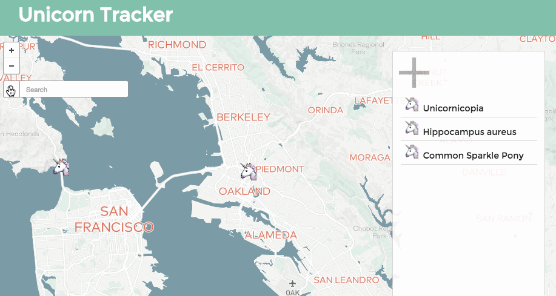

# Unicorn-Tracker

A simple interactive map using Mapbox's API that allows users to track unicorns worldwide, and journal about their encounters. Pins can be placed using either cursor input or manual inputs. Details from the form are bound to each pin on submit using a custom styleable html popup.

[](http://adynata.github.io/Unicorn-Tracker/)

##To run locally:

```
git clone git@github.com:adynata/Unicorn-Tracker.git
npm install
bower install
http-server
open http://192.168.1.6:8080/

```
